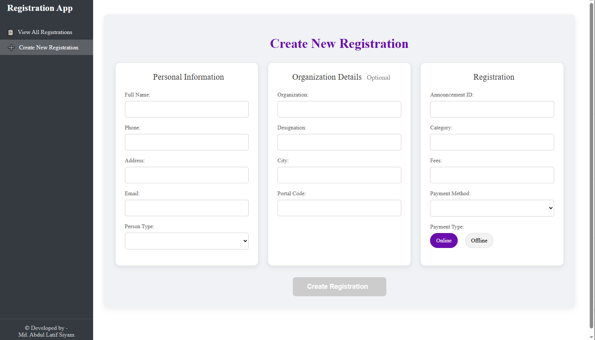
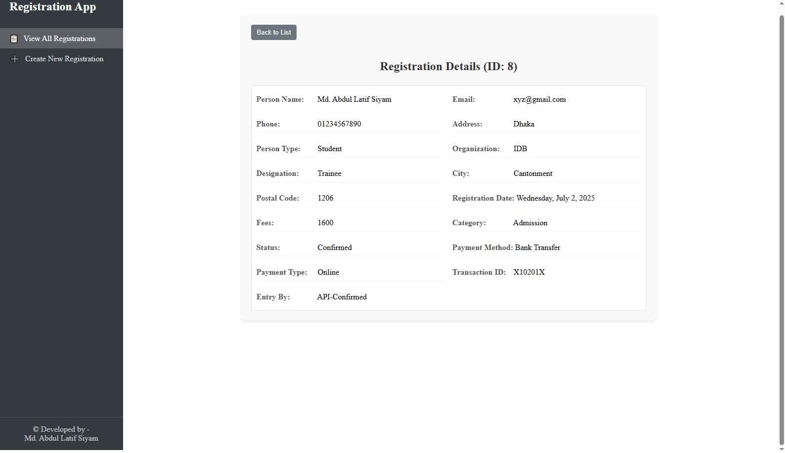
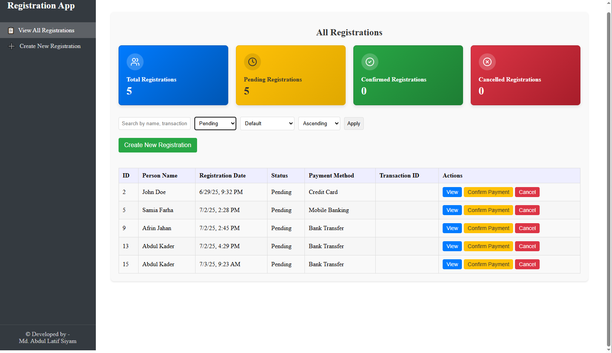

# Registration Form Management System

This project is a comprehensive Registration Form Management System, featuring a user-friendly frontend built with Angular-TypeScript and a robust backend powered by ASP.NET Core API. It allows users to create new registrations, view all existing registrations, manage payment statuses (confirm/cancel), and offers searching, filtering, and sorting capabilities for easy data navigation.

## Features

* **Create New Registration:** A dedicated page to input personal information, organization details, and registration specifics.
* **View All Registrations:** A central dashboard to see all registrations at a glance.
* **Status Overview:** Cards displaying total, pending, confirmed, and cancelled registrations for quick insights.
* **Payment Management:** Easily confirm successful payments or cancel registrations directly from the list.
* **Detailed Registration View:** Click to view comprehensive details of any registration.
* **Search & Filter:** Search by name or transaction ID, and filter registrations by status (Pending, Confirmed, Cancelled, All).
* **Sorting:** Sort registrations by various criteria.
* **Admin-like Interface:** Top header and left-panel navigation for an intuitive user experience.

## Screenshots

### All Registrations Dashboard (Default View)


### Create New Registration Form


### Registration Details View


### All Registrations Dashboard (Filtered by Pending)


### All Registrations Dashboard (Filtered by Confirmed)


### All Registrations Dashboard (Filtered by Cancelled)


## Technologies Used

* **Frontend:** Angular, TypeScript
* **Backend:** ASP.NET Core API (.NET 8)
* **Database:** MS SQL Server (via Entity Framework Core)

## Getting Started

Follow these steps to set up and run the Registration Form Management System on your local machine.

### Prerequisites

* [.NET 8 SDK](https://dotnet.microsoft.com/download/dotnet/8.0) (for ASP.NET Core)
* [Node.js](https://nodejs.org/en/download/) and [npm](https://www.npmjs.com/get-npm) (for Angular)
* [Angular CLI](https://angular.io/cli) (`npm install -g @angular/cli`)
* [Visual Studio 2022](https://visualstudio.microsoft.com/vs/) (Recommended for backend development)
* [MS SQL Server](https://www.microsoft.com/en-us/sql-server/sql-server-downloads) (Any recent version is suitable, e.g., SQL Server 2019 or 2022, or SQL Server Express for local development)

### Installation

1.  **Clone the Repository:**
    ```bash
    git clone [https://github.com/MdALSiyam/Registration-Form-Management-System.git](https://github.com/MdALSiyam/Registration-Form-Management-System.git)
    ```

2.  **Backend Setup (ASP.NET Core API):**

    * **Open in Visual Studio:** Open the cloned project in Visual Studio 2022.
    * **Configure Database Connection:**
        Navigate to `appsettings.json` in your backend project and modify the `DefaultConnection` string:
        ```json
        "ConnectionStrings": {
          "DefaultConnection": "Server=YOUR_SERVER_NAME; Database=YOUR_DATABASE_NAME; Trusted_Connection=True; MultipleActiveResultSets=true; TrustServerCertificate=True"
        }
        ```
        **Replace `YOUR_SERVER_NAME` with your MS SQL Server instance name and `YOUR_DATABASE_NAME` with your desired database name.**
    * **Apply Migrations:**
        Open the Package Manager Console in Visual Studio (Tools > NuGet Package Manager > Package Manager Console) and run the following commands:
        ```powershell
        dotnet restore
        Update-Database
        ```
    * **Run the API:**
        Run the ASP.NET Core API project from Visual Studio. This will typically open a browser window with the API documentation (e.g., Swagger UI). Keep this running.

3.  **Frontend Setup (Angular-TypeScript):**

    * **Navigate to Frontend Directory:**
        Open your terminal or command prompt and navigate into the `registration-frontend` folder:
        ```bash
        cd registration-frontend
        ```
    * **Open in VS Code (Optional but Recommended):**
        ```bash
        code .
        ```
    * **Install Dependencies:**
        In a new terminal within VS Code (or your preferred terminal), install the necessary Node.js packages:
        ```bash
        npm install
        ```
    * **Run the Angular Application:**
        Start the Angular development server:
        ```bash
        ng serve
        ```
        This will compile the Angular application and typically make it available at `http://localhost:4200`.

## Usage

Once both the backend API and the Angular frontend are running:

1.  Open your web browser and navigate to `http://localhost:4200` (or the address where `ng serve` is running).
2.  You will see the "All Registrations" dashboard.
3.  Use the "Create New Registration" button to add new entries.
4.  Utilize the search, filter, and sort options to manage your registrations.
5.  From the "All Registrations" list, you can "Confirm Payment" or "Cancel" a pending registration, or "View" its details.
